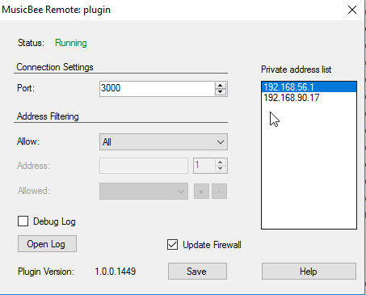

[](https://ci.appveyor.com/project/kelsos/plugin/branch/master)
[](https://codecov.io/gh/musicbeeremote/plugin)
[](https://sonarcloud.io/dashboard?id=musicbeeremote_plugin)
[](https://discordapp.com/invite/rceTb57)
[](https://gitter.im/musicbee-remote/Lobby?utm_source=badge&utm_medium=badge&utm_campaign=pr-badge&utm_content=badge)

<br/>
<p align="center">
    <a href="https://github.com/musicbeeremote/plugin">
    
    </a>

<h3 align="center">MusicBee Remote (plugin)</h3>
    <p align="center">
        A Plugin for MusicBee that allows you to control it through the MusicBee Remote Android Application
        <br/>
        <a href="https://play.google.com/store/apps/details?id=com.kelsos.mbrc">Application</a>
        <br/>
        <br/>
        <a href="https://mbrc.kelsos.net/help/">Help</a>
        ·
        <a href="http://getmusicbee.com/forum/index.php?topic=7221.new;topicseen#new">MusicBee Forum</a>
        ·
        <a href="https://github.com/musicbeeremote/plugin/issues">Report Bug</a>
        ·
        <a href="https://github.com/musicbeeremote/plugin/issues">Request Feature</a>
    </p>
</p>

## Table of Contents

* [About the Project](#about-the-project)
  * [Built With](#built-with)
* [Getting Started](#getting-started)
  * [Prerequisites](#prerequisites)
  * [Installation](#installation)
* [Usage](#usage)
* [Contributing](#contributing)
* [License](#license)
* [Contact](#contact)
* [Acknowledgements](#acknowledgements)

## About the Project

<p align="center">
    <a href="https://mbrc.kelsos.net">
    
    <a/>
</p>

The plugin is an essential part of [MusicBee Remote](https://github.com/musicbeeremote/). It acts as a bridge that allows
the Android application to communicate with [MusicBee](http://getmusicbee.com/). The plugin exposes a socket server (TCP) that
listens for incoming connections from the plugin.

It uses a text based [protocol](PROTOCOL.md) that is uses newline separated JSON messages. Thoses messages are then translated to
calls of the MusicBee API.

The plugin also implements an intermediate caching layer for library metadata.

### Built With

* [Newtonsoft.Json](https://github.com/JamesNK/Newtonsoft.Json)
* [NLog](https://github.com/NLog/NLog)
* [TinyMessenger](https://github.com/grumpydev/TinyMessenger)
* [LiteDB](https://github.com/mbdavid/LiteDB)
* [StructureMap](https://github.com/structuremap/structuremap/)

## Getting Started

In order to get started with the project as a developer there are a few steps you need to follow.

### Prerequisites

The project requires [Visual Studio 2019 Community](https://visualstudio.microsoft.com/vs/community/).
Parts of it can run on `Mono`, for example the [mbrc-tester](./mbrc-tester), so you should be able
to work on parts of the protocol implementation without the need of Windows and Visual Studio, however,
for integration testing an environment with Windows, Visual Studio and MusicBee installed is required.

After getting the basic environment setup you just need to clone the project from command line:

```bash
git clone https://github.com/musicbeeremote/android-app.git
```

or you could use your visual Git interface to clone the repository.

### Installation

After cloning the project you can go and open the `MBRC.sln` solution in `Visual Studio`. The first
thing you need to do is to restore the `NuGet` dependencies so that you can start build the solution.

## Usage

While building and testing the application you need a network interface that will listen for incoming
connections. This has to be in the same network as the one where the device you use to test is.

If you are using a Windows Virtual Machine for development as I do, then you have to make sure that the
virtual machine is using a `Bridged` connection, otherwise you might not be able to connect to the plugin.

## Contributing

Contributions are always welcome.
The contribution guide should follow soon.

## Building

You can build the application either through Visual Studio or by running `build.bat`.
The bat file supports either `Release` by default or `Debug` configurations.

It will also copy the merged `mb_remote.dll` to the MusicBee plugin's folder.

## License

The source code of the application is licensed under the [GPLv3](https://www.gnu.org/licenses/gpl.html) license. See `LICENSE` for more information

    MusicBee Remote (Plugin for MusicBee)
    Copyright (C) 2011-2020  Konstantinos Paparas

    This program is free software: you can redistribute it and/or modify
    it under the terms of the GNU General Public License as published by
    the Free Software Foundation, either version 3 of the License, or
    (at your option) any later version.

    This program is distributed in the hope that it will be useful,
    but WITHOUT ANY WARRANTY; without even the implied warranty of
    MERCHANTABILITY or FITNESS FOR A PARTICULAR PURPOSE.  See the
    GNU General Public License for more details.

    You should have received a copy of the GNU General Public License
    along with this program.  If not, see <http://www.gnu.org/licenses/>.

## Contact

MusicBee Remote - [@MusicBeeRemote](https://twitter.com/musicbeeremote)

Project Link: [https://github.com/musicbeeremote/mbrc](https://github.com/musicbeeremote/mbrc)

## Acknowledgements

* Steven Mayall

For making such a great music player, and for all his assistance with API support.
