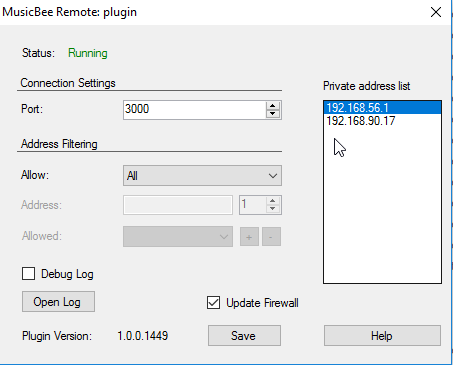

[](https://github.com/musicbeeremote/mbrc-plugin/actions/workflows/ci.yml)
[](https://discordapp.com/invite/rceTb57)

<br/>
<p align="center">
    <a href="https://github.com/musicbeeremote/plugin">
    
    </a>

<h3 align="center">MusicBee Remote (plugin)</h3>
    <p align="center">
        A Plugin for MusicBee that allows you to control it through the MusicBee Remote Android Application
        <br/>
        <a href="https://github.com/musicbeeremote/mbrc">Application</a>
        <br/>
        <br/>
        <a href="https://mbrc.kelsos.net/help/">Help</a>
        ·
        <a href="http://getmusicbee.com/forum/index.php?topic=7221.new;topicseen#new">MusicBee Forum</a>
        ·
        <a href="https://github.com/musicbeeremote/mbrc-plugin/issues">Report Bug</a>
        ·
        <a href="https://github.com/musicbeeremote/mbrc-plugin/issues">Request Feature</a>
    </p>
</p>

## Table of Contents

* [About the Project](#about-the-project)
  * [Built With](#built-with)
  * [Project Structure](#project-structure)
* [Installation](#installation)
* [Getting Started](#getting-started)
  * [Prerequisites](#prerequisites)
* [Usage](#usage)
* [Contributing](#contributing)
* [Building](#building)
* [Testing](#testing)
* [Formatting](#formatting)
* [Releasing](#releasing)
* [License](#license)

## About the Project

<p align="center">
    <a href="https://mbrc.kelsos.net">
    
    <a/>
</p>

The plugin is an essential part of [MusicBee Remote](https://github.com/musicbeeremote/). It acts as a bridge that allows
the Android application to communicate with [MusicBee](http://getmusicbee.com/). The plugin exposes a socket server (TCP) that
listens for incoming connections from the plugin.

It uses a text based protocol that is uses newline separated JSON messages. Those messages are then translated to
calls of the MusicBee API.

### Built With

* [Autofac](https://github.com/autofac/Autofac) - Dependency Injection
* [Newtonsoft.Json](https://github.com/JamesNK/Newtonsoft.Json) - JSON serialization
* [NLog](https://github.com/NLog/NLog) - Logging

### Project Structure

```
mbrc-plugin/
├── core/             # Core library - business logic, services, protocol handling
├── plugin/           # MusicBee plugin - API integration, adapters
├── tests/            # Unit tests (xUnit, FluentAssertions, Moq)
├── api-debugger/     # Protocol testing GUI utility
└── firewall-utility/ # Windows firewall configuration tool
```

The `core` library is merged into `plugin` during build using ILRepack, producing a single `mb_remote.dll`.

## Installation

Download the latest version from [releases](https://github.com/musicbeeremote/mbrc-plugin/releases).

### Installer (Recommended)

1. Download `musicbee_remote_x.x.x.exe`
2. Run the installer
3. The installer will automatically detect your MusicBee installation and install the plugin
4. Restart MusicBee if it was running

**Note:** The installer requires MusicBee 3.1 or later.

### Manual Installation (ZIP)

Use this method for the Microsoft Store version of MusicBee or if you prefer manual installation:

1. Download `musicbee_remote_x.x.x.zip`
2. Extract the contents
3. Copy `mb_remote.dll` to your MusicBee Plugins folder:
   - Regular installation: `C:\Program Files (x86)\MusicBee\Plugins\`
   - Store version: `%LOCALAPPDATA%\Packages\...\LocalCache\Roaming\MusicBee\Plugins\`
4. Optionally copy `firewall-utility.exe` if you need to configure Windows Firewall
5. Restart MusicBee

### Verify Installation

After installation, the plugin should appear in MusicBee under `Edit > Preferences > Plugins`.

## Getting Started

As a developer there are a few steps you need to follow to get started:

### Prerequisites

* [Visual Studio 2026 Community](https://visualstudio.microsoft.com/vs/community/) (2022 also supported)
* [.NET Framework 4.8](https://dotnet.microsoft.com/download/dotnet-framework/net48) SDK
* [MusicBee](http://getmusicbee.com/) installed (for testing)

After getting the basic environment setup you just need to clone the project from command line:

```bash
git clone https://github.com/musicbeeremote/mbrc-plugin.git
```

or you could use your visual Git interface to clone the repository.

### Installation

After cloning the project you can go and open the `MBRC.sln` solution in `Visual Studio`. The first
thing you need to do is to restore the `NuGet` dependencies so that you can start build the solution.

## Usage

While building and testing the application you need a network interface that will listen for incoming
connections. This has to be in the same network as the one where the device you use to test is.

If you are using a Windows Virtual Machine for development as I do, then you have to make sure that the
virtual machine is using a `Bridged` connection, otherwise you might not be able to connect to the plugin.

## Contributing

Contributions are always welcome.
The contribution guide should follow soon.

## Building

You can build the application using any of these methods:

**Visual Studio:**
Open `MBRC.sln` and build the solution.

**Command Line:**
```bash
dotnet build -c Release
```

**Build Script (Windows / PowerShell):**
```powershell
.\build-msbuild.ps1                       # Release build (default)
.\build-msbuild.ps1 -Configuration Debug  # Debug build
```

The build process:
1. Compiles `core` and `plugin` projects
2. Uses ILRepack to merge `MusicBeeRemote.Core.dll` into `mb_remote.dll`
3. In Debug mode, copies `mb_remote.dll` to MusicBee's Plugins folder

## Testing

The test project uses xUnit with FluentAssertions and Moq:

```bash
dotnet test tests/MusicBeeRemote.Core.Tests.csproj
```

Note: Tests require Windows to run (net48 target framework).

## Formatting

The project uses [EditorConfig](https://editorconfig.org/) for consistent code formatting. Most IDEs support EditorConfig natively or via plugins.

**Check formatting:**
```bash
dotnet format --verify-no-changes
```

**Apply formatting:**
```bash
dotnet format
```

**Key style rules:**
- 4 spaces indentation for C# files
- Braces on new lines (Allman style)
- Sort `System` usings first
- Use explicit types for built-in types, `var` when type is apparent

## Releasing

Releases are automated via GitHub Actions when a version tag is pushed.

### Version Management

The version is centralized in `Directory.Build.props`:

```xml
<VersionPrefix>1.5.0</VersionPrefix>
```

All projects (plugin, core, firewall-utility, api-debugger) inherit this version automatically.

### Creating a Release

1. **Update the version** in `Directory.Build.props`
2. **Update `CHANGELOG.md`** with release notes
3. **Commit the changes:**
   ```bash
   git add Directory.Build.props CHANGELOG.md
   git commit -m "chore: bump version to 1.5.0"
   git push
   ```
4. **Create and push a tag:**
   ```bash
   git tag v1.5.0
   git push origin v1.5.0
   ```

The CI pipeline will automatically:
- Build the plugin with the tagged version
- Create the NSIS installer (`musicbee_remote_1.5.0.exe`)
- Create the ZIP archive (`musicbee_remote_1.5.0.zip`)
- Generate SHA512 checksums
- Create build provenance attestations
- Publish a GitHub Release with all artifacts

### Development Builds

Commits to `main` branch produce development builds with version suffix:
- Example: `1.5.0-nightly.123` (where 123 is the build number)

These are available as workflow artifacts but not published as releases.

## License

The source code of the application is licensed under the [GPLv3](https://www.gnu.org/licenses/gpl.html) license. See `LICENSE` for more information

    MusicBee Remote (Plugin for MusicBee)
    Copyright (C) 2011-2026  Konstantinos Paparas

    This program is free software: you can redistribute it and/or modify
    it under the terms of the GNU General Public License as published by
    the Free Software Foundation, either version 3 of the License, or
    (at your option) any later version.

    This program is distributed in the hope that it will be useful,
    but WITHOUT ANY WARRANTY; without even the implied warranty of
    MERCHANTABILITY or FITNESS FOR A PARTICULAR PURPOSE.  See the
    GNU General Public License for more details.

    You should have received a copy of the GNU General Public License
    along with this program.  If not, see <http://www.gnu.org/licenses/>.
