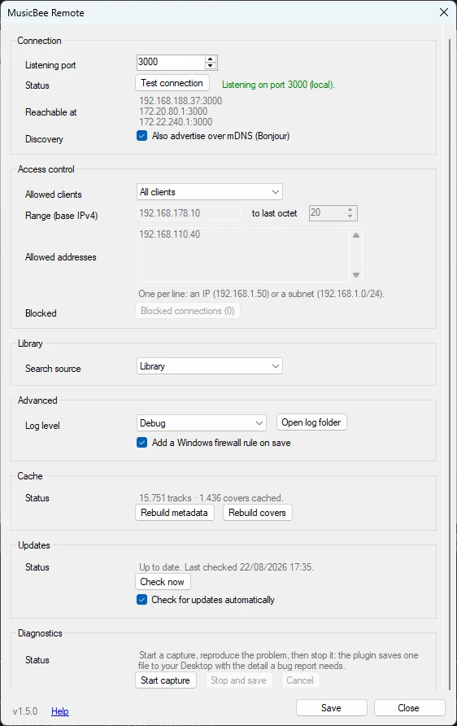

[](https://github.com/musicbeeremote/mbrc-plugin/actions/workflows/ci.yml)
[](https://discordapp.com/invite/rceTb57)

<br/>
<p align="center">
    <a href="https://github.com/musicbeeremote/plugin">
    
    </a>

<h3 align="center">MusicBee Remote (plugin)</h3>
    <p align="center">
        A Plugin for MusicBee that allows you to control it through the MusicBee Remote Android Application
        <br/>
        <a href="https://github.com/musicbeeremote/mbrc">Application</a>
        <br/>
        <br/>
        <a href="https://mbrc.kelsos.net/help/">Help</a>
        ·
        <a href="http://getmusicbee.com/forum/index.php?topic=7221.new;topicseen#new">MusicBee Forum</a>
        ·
        <a href="https://github.com/musicbeeremote/mbrc-plugin/issues/new?template=bug.yml">Report Bug</a>
        ·
        <a href="https://github.com/musicbeeremote/mbrc-plugin/issues/new?template=feature.yml">Request Feature</a>
    </p>
</p>

## Table of Contents

* [About the Project](#about-the-project)
  * [Built With](#built-with)
  * [Project Structure](#project-structure)
  * [Documentation](#documentation)
* [Reporting a Problem](#reporting-a-problem)
* [Installation](#installation)
* [Getting Started](#getting-started)
  * [Prerequisites](#prerequisites)
* [Usage](#usage)
* [Contributing](#contributing)
* [Building](#building)
* [Testing](#testing)
* [Formatting](#formatting)
* [Releasing](#releasing)
* [License](#license)

## About the Project

<p align="center">
    <a href="https://mbrc.kelsos.net">
    
    <a/>
</p>

The plugin is an essential part of [MusicBee Remote](https://github.com/musicbeeremote/). It acts as a bridge that allows
the Android application to communicate with [MusicBee](http://getmusicbee.com/). The plugin exposes a socket server (TCP) that
listens for incoming connections from the plugin.

It uses a text based protocol that is uses newline separated JSON messages. Those messages are then translated to
calls of the MusicBee API.

### Built With

The plugin core is written in Rust; the C# side is a thin shim over MusicBee's
plugin API.

* [serde](https://serde.rs/) / [serde_json](https://github.com/serde-rs/json) - wire codec
* [tokio](https://tokio.rs/) - the socket server and its per-connection tasks
* [redb](https://github.com/cberner/redb) - embedded store for the library and cover caches
* [MessagePack-CSharp](https://github.com/MessagePack-CSharp/MessagePack-CSharp) - FFI DTO serialization
* [Costura.Fody](https://github.com/Fody/Costura) - embeds the managed dependencies into `mb_remote.dll`
* [minisign-verify](https://github.com/jedisct1/rust-minisign-verify) - release manifest signatures
* [mdns-sd](https://github.com/keepsimple1/mdns-sd) - DNS-SD advertisement, alongside the custom discovery

### Project Structure

```
mbrc-plugin/
├── packages/
│   ├── mbrc-core/      # Rust core (mbrc_core.dll): server, dispatch, caches, FFI
│   ├── mbrc-wire/      # Wire codec and handshake
│   ├── mbrc-discovery/ # UDP multicast discovery responder
│   ├── mbrc-capture/   # Capture and fixture tooling
│   ├── mbrc-release/   # Release manifest parsing, signature verification
│   ├── mbrc-helper/    # Elevated helper exe: firewall rule, staged update apply
│   ├── mbrc-buildinfo/ # Stamps the product version into the Rust binaries
│   └── plugin/         # MusicBee plugin (mb_remote.dll): entry point, API callbacks
├── tests/
│   ├── csharp/         # xUnit suite for the C# shim
│   └── golden/         # Committed golden wire traces
└── tools/
    ├── mbrc-cli/       # Headless CLI: send, monitor, capture, replay
    └── api-debugger/   # Protocol testing app (Tauri + Vue, standalone)
```

The C# core was folded into the plugin project, so the managed side builds as a
single `mb_remote.dll` with its NuGet dependencies embedded by Costura. The
native `mbrc_core.dll` and `mbrc-helper.exe` are not embedded and ship
side-by-side with it.

### Documentation

* [`docs/protocol.md`](docs/protocol.md) - the wire protocol: commands, events,
  and both discovery mechanisms (custom UDP multicast and mDNS / DNS-SD)
* [`docs/updates.md`](docs/updates.md) - the update mechanism end to end: the
  signed manifest, the channels, staging, and the elevated helper
* [`docs/troubleshooting.md`](docs/troubleshooting.md) - where the logs live, how
  to capture a problem, and what the diagnostics file contains

## Reporting a problem

Open the Configure window, press **Start capture** in the Diagnostics group,
reproduce the problem, then press **Stop and save**. Attach the zip that lands on
your Desktop to a
[bug report](https://github.com/musicbeeremote/mbrc-plugin/issues/new?template=bug.yml).
It carries the versions, settings and detailed log a report needs, so nobody has
to ask you for them. [`docs/troubleshooting.md`](docs/troubleshooting.md) lists
exactly what is in it and what is redacted.

## Installation

Download the latest version from [releases](https://github.com/musicbeeremote/mbrc-plugin/releases).

### Installer (Recommended)

1. Download `musicbee_remote_x.x.x.exe`
2. Run the installer
3. The installer will automatically detect your MusicBee installation and install the plugin
4. Restart MusicBee if it was running

**Note:** The installer requires MusicBee 3.1 or later.

### Manual Installation (ZIP)

Use this method for the Microsoft Store version of MusicBee or if you prefer manual installation:

1. Download `musicbee_remote_x.x.x.zip`
2. Extract the contents
3. Copy **both** `mb_remote.dll` and `mbrc_core.dll` to your MusicBee Plugins folder:
   - Regular installation: `C:\Program Files (x86)\MusicBee\Plugins\`
   - Store version: `%LOCALAPPDATA%\Packages\...\LocalCache\Roaming\MusicBee\Plugins\`

   The plugin loads the native core at startup, so they must sit side by side.
4. Copy `mbrc-helper.exe` as well. It is optional, but it is what adds the Windows
   Firewall rule and what installs updates the plugin downloads - without it,
   "Install and restart" in the settings has nothing to run
5. Restart MusicBee

### Verify Installation

After installation, the plugin should appear in MusicBee under `Edit > Preferences > Plugins`.

### Uninstalling

If you installed with the installer, use `Uninstall MusicBee Remote` from the Start
Menu (or `mbremoteuninstall.exe` in MusicBee's `Plugins` folder). It removes all
three files and the plugin's stored settings, caches and logs.

If you installed from the zip, remove the plugin in MusicBee under
`Edit > Preferences > Plugins`. It takes its own files with it: `mbrc_core.dll`,
`mbrc-helper.exe` and the two text files, plus the stored settings, caches and
logs, all while MusicBee is still running. MusicBee deletes `mb_remote.dll` itself
the next time it starts, so the folder is only fully clear after a restart.

## Getting Started

As a developer there are a few steps you need to follow to get started:

### Prerequisites

* [Visual Studio 2026 Community](https://visualstudio.microsoft.com/vs/community/) (2022 also supported)
* [.NET Framework 4.8](https://dotnet.microsoft.com/download/dotnet-framework/net48) SDK
* [Rust](https://rustup.rs/) with the 32-bit Windows target - the core and the
  helper are Rust, and the plugin is x86, so they must be built for
  `i686-pc-windows-msvc`:

  ```bash
  rustup target add i686-pc-windows-msvc
  ```

  The toolchain version itself is pinned by `rust-toolchain.toml`, so rustup
  fetches the right one on the first build.
* [MusicBee](http://getmusicbee.com/) installed (for testing)

After getting the basic environment setup you just need to clone the project from command line:

```bash
git clone https://github.com/musicbeeremote/mbrc-plugin.git
```

or you could use your visual Git interface to clone the repository.

### Installation

After cloning the project you can go and open the `MBRC.sln` solution in `Visual Studio`. The first
thing you need to do is to restore the `NuGet` dependencies so that you can start build the solution.

## Usage

While building and testing the application you need a network interface that will listen for incoming
connections. This has to be in the same network as the one where the device you use to test is.

If you are using a Windows Virtual Machine for development as I do, then you have to make sure that the
virtual machine is using a `Bridged` connection, otherwise you might not be able to connect to the plugin.

## Contributing

Contributions are always welcome.
The contribution guide should follow soon.

## Git hooks

```powershell
.uild.ps1 -SetupHooks
```

One command per clone. Points `core.hooksPath` at [`tools/hooks`](tools/hooks),
so the hooks are versioned and reviewable rather than living unseen in
`.git/hooks`. `commit-msg` enforces Conventional Commits (matching
`@commitlint/config-conventional`, and re-checked in CI over every commit in a
pull request); `pre-commit` checks formatting (~2s); `pre-push` runs clippy, the
test suites, the generated-FFI-bindings drift check and `dotnet format`
(~2-4 min). Skip with `MBRC_SKIP_HOOKS=1`. They run on your platform only,
so CI still has the last word - see [`tools/hooks/README.md`](tools/hooks/README.md).

## Building

You can build the application using any of these methods:

**Visual Studio:**
Open `MBRC.sln` and build the solution.

**Command Line:**
```bash
dotnet build -c Release
```

**Build Script (Windows / PowerShell):**
```powershell
.\build.ps1                       # both halves, Release
.\build.ps1 -Configuration Debug  # both halves, Debug
.\build.ps1 -Rust                 # just the Rust core + helper
.\build.ps1 -Plugin               # just the C# plugin
.\build.ps1 -Clean                # remove build output first
```

The build process:
1. Builds the Rust core and helper for `i686-pc-windows-msvc`
2. Compiles the plugin project into `mb_remote.dll`, with Costura embedding the
   managed NuGet dependencies
3. In Debug mode, copies `mb_remote.dll`, `mbrc_core.dll` and `mbrc-helper.exe`
   to MusicBee's Plugins folder for a live test install; Release only stages them
   under `build\bin\plugin\`

`build-msbuild.ps1` is the C#-solution entry point, but it is not Rust-free: the
plugin project has an MSBuild target that invokes `build.ps1 -Rust`, so the core
and helper are built either way. That target is also why `dotnet build` and
Visual Studio produce a complete set of binaries.

## Testing

The C# suite uses xUnit:

```bash
dotnet test tests/csharp/MusicBeeRemote.Core.Tests.csproj
```

Note: these require Windows to run (net48 target framework).

The Rust suites run for the target the plugin actually ships as:

```bash
cargo test --workspace --target i686-pc-windows-msvc
```

## Formatting

The project uses [EditorConfig](https://editorconfig.org/) for consistent code formatting. Most IDEs support EditorConfig natively or via plugins.

**Check formatting:**
```bash
dotnet format --verify-no-changes
```

**Apply formatting:**
```bash
dotnet format
```

**Key style rules:**
- 4 spaces indentation for C# files
- Braces on new lines (Allman style)
- Sort `System` usings first
- Use explicit types for built-in types, `var` when type is apparent

## Releasing

Releases are automated via GitHub Actions when a version tag is pushed.

### Version Management

The version is centralized in `Directory.Build.props`:

```xml
<VersionPrefix>1.5.0</VersionPrefix>
```

Every shipped component inherits this version automatically: the C# assemblies
through MSBuild, and `mbrc_core.dll` + `mbrc-helper.exe` through `mbrc-buildinfo`,
which reads the same `<VersionPrefix>` at compile time. Bumping it here is the
only edit needed. CI overrides the Rust stamp via the `MBRC_VERSION` environment
variable, so a build from a tag carries the tag's full version rather than the
bare prefix.

The version the plugin reports to the updater is the *informational* version, not
`AssemblyVersion` - MSBuild strips prerelease suffixes from the latter, which
would make `1.5.0-beta.1` indistinguishable from `1.5.0` and leave a prerelease
unable to update itself.

### Creating a Release

1. **Update the version** in `Directory.Build.props`
2. **Update `CHANGELOG.md`** with release notes
3. **Commit the changes:**
   ```bash
   git add Directory.Build.props CHANGELOG.md
   git commit -m "chore: bump version to 1.5.0"
   git push
   ```
4. **Create and push a tag:**
   ```bash
   git tag v1.5.0
   git push origin v1.5.0
   ```

The CI pipeline will automatically:
- Build the plugin with the tagged version
- Create the NSIS installer (`musicbee_remote_1.5.0.exe`)
- Create the ZIP archive (`musicbee_remote_1.5.0.zip`)
- Generate SHA512 checksums
- Create build provenance attestations
- Emit and sign `manifest.json`, which is what the in-plugin updater verifies
- Publish a GitHub Release with all artifacts

### Prereleases

A tag with a prerelease suffix routes itself - no separate workflow and no extra
flags:

```bash
git tag v1.5.0-beta.1
git push origin v1.5.0-beta.1
```

It is packaged, attested and signed exactly like a stable release; only two
things differ. The manifest records `channel: testing` instead of `stable`, and
the GitHub release is marked as a pre-release, which keeps it out of
`releases/latest` - the endpoint the stable update channel follows. Users on the
`testing` channel find it because that channel lists releases instead.

See [`docs/updates.md`](docs/updates.md) for the channels, how to switch between
them, and what the updater verifies before it installs anything.

### Development Builds

Commits to `main` branch produce development builds with version suffix:
- Example: `1.5.0-nightly.123` (where 123 is the build number)

These are available as workflow artifacts but not published as releases.

## License

The source code of the application is licensed under the [GPLv3](https://www.gnu.org/licenses/gpl.html) license. See `LICENSE` for more information

    MusicBee Remote (Plugin for MusicBee)
    Copyright (C) 2011-2026  Konstantinos Paparas

    This program is free software: you can redistribute it and/or modify
    it under the terms of the GNU General Public License as published by
    the Free Software Foundation, either version 3 of the License, or
    (at your option) any later version.

    This program is distributed in the hope that it will be useful,
    but WITHOUT ANY WARRANTY; without even the implied warranty of
    MERCHANTABILITY or FITNESS FOR A PARTICULAR PURPOSE.  See the
    GNU General Public License for more details.

    You should have received a copy of the GNU General Public License
    along with this program.  If not, see <http://www.gnu.org/licenses/>.
